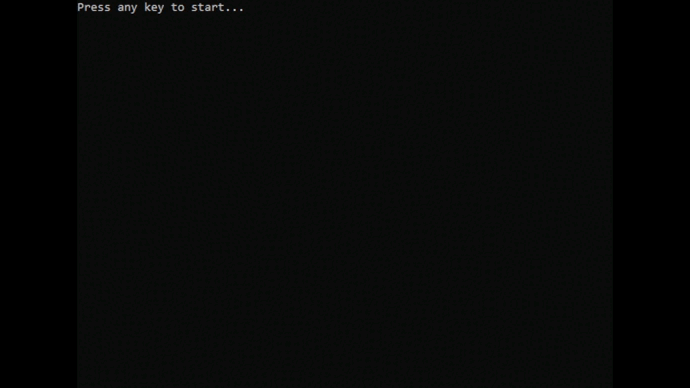

# Application "Snake-Game"

## About

This program is a simple implementation of the classic game "Snake" in the console.

## Getting Started

### Download

See the [Releases page](https://github.com/Azonos712/SimpleConsoleSnake/releases).

### Running

Unzip the archive and run the executable file. 

## Requirements

[.NET 6.0](https://dotnet.microsoft.com/download/dotnet/6.0)

## Build

Visual Studio 2022

## Contributing

I will be glad if you find bugs or have ideas for improving the app.

Thank you!

## Authors

* **Nikolay Bezdetniy** - [Azonos712](https://github.com/Azonos712)

## License
[MIT](https://choosealicense.com/licenses/mit/)
